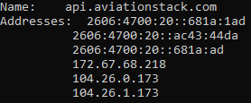

# ITNE352-Project---GroupSA12---2nd Semester 2024\2025

### Title: Flights Multithreaded Server-Client System
 
 Name: Mohammed Abdulsalam &nbsp;
 ID: 202210939 &nbsp;
 Section: 1

Table of Contents:
1. Script Requirements
2. Run the Scripts
3. Scripts Description
4. Additional Concept
5. Acknowledgments
6. Conclusion

   

## Script Requirements:
 

For this project, I used a handful of libraries to get an excellent and fault tolerant environment [[1]](#ref1). __(Note: this script is designed for python version 3 and above, make sure you have it downloaded at latest version )__

  

* Request library [[2]](#ref2) : 
    * This library uses HTTP protocol to get or post data to a website. In this project, it is use to fetch the data from the API, getting all needed information to make the server handle the clients requests.

    * This library must be downloaded first as it is not built-in python library. Using this command in the command prompt will download it: 
__pip3 install requests__ 

    * This command will ensure to download the library for python3, which is the most modern.

* JSON library :
For this library, it is used to extract the data in JSON format. This allows to organize the output that will be shown for the client. This library is built-in python library, so there should be no installation required.

* Socket library:
It is used to create sockets for clients and the server so the can communicate through. This library is built-in python library, so there should be no installation required.

* Threading library [[3]](#ref3):
It allows the socket to handle multiple communications simultaneously. This is the main idea for this project. This library is built-in python library, so there should be no installation required.

* Time library:
Not much included within script, but it is crucial. As I will illustrate later, I used __time.sleep()__ function to make server handle the first input from the user and not to mix up with the next input. This library is built-in python library, so there should be no installation required.
 
These are all the libraries that are going to be used to run the scripts. Only request library needs to be downloaded, the other ones are built-in libraries. 
If, for any reason, one of these libraries are not already downloaded just run this command in your command prompt followed by the library name to install it:

**pip3 install** (name of the library in lowercase. [e.g. threading])
   

> Run Scripts:

After making sure all libraries are successfully installed, take the scripts and place them in the same folder. If any of the scripts are not inside the same folder as the rest of the scripts, then the whole system will not work, as they depend on each other.

1.	Then you must run the server script first, so it will go passive and start listening for any incoming requests from clients. You can run in your code editor or using your device command prompt. **(Steps for running in command prompt are illustrated down)**

2. In command prompt, you will run the interface script, where you can communicate with the server through. 
    * First make sure to enter the folder that saved the scripts inside. Using the file explorer go to the folder location, then you can find the path at the top **(Blue Circle)**. 
    * Press on the empty space **(Red DOT in picture)** inside the location panel and copy it
    

3. In the command prompt, type: **cd (paste the path)** then press enter. 
    * Now you are inside the folder, to run the interface script type: **python3 interface_module.py** then press enter.
    * If it did not work, try : **python interface_module.py**.

4. At the beginning, it will ask for your name then the ICAO for the airport you want to get information about.

5. After that you can easily interact with the server via menu of options for server to execute. Only enter the number of the service you want ( 1-4) and the server will handle everything for you and return the desired information, if there is any.

  

> Scripts Descriptions:
 

1.	**API script [ api.py]** [[4]](#ref4):
 This script includes functions that are going to be used for fetching data from the **aviation.com** API, saving data in a JSON file, and retrieve data from the file based on client prompt.
 
Here is a list with the main functions of **api.py** script, and a description of each:
 
 

| Main Functions    | Description     |
|-------------|--------------|
| `save_to_file(data, filename='group_SA12.json')` |It takes two parameters **data** which is the fetched data from  **aviation.com** API & **filename** is the name of the file that data will be saved inside, and it is always '**group_SA12.json**'. This function stores the data to a file, so server can retreive data from it.  |
| `get_flights_by_airport_code(icao_code)`     |Takes one parameter, which is **icao_code** of the airport that data will be fetched about. The function uses **request** library to get the data of the airport, and return the data it gets ( if there are any).  | 
| `get_arrived_flights(data)` |Takes the **data** of the airport, and returns list of dictionary details about flights that arrived at the airport|
| `get_delayed_flights(data)` |Takes the **data** of the airport, and returns list of dictionary details about flights that are delayed|
| `get_flight_details(iata_code)` |This function takes the **iata_code** of the flight, and then fetch data related to it from **aviation.com** API. It returns a dictionary of details about the flight|
 
 Subfunctions are imported from other libraries and used within the main functions of the script. Here is a list with the subfunctions of **api.py** script, and a description of each:
  

| Subfunction          | Description     |
|---------------------|--------------------|
| `json.dump(data, f, indent=4)`|This function from **json** saves the data in JSON format [[5]](#ref5). I give it three parameters **data** fetched, **f** is the file name,and **indent** is the indentation inside the file to orgnize it  |
| `requests.get(BASE_URL, params)`|This function from **request** library sends a HTTP GET request. Takes the **BASE_URL** which is the URL of the website, and **params** it has to be predefined and contains extra information for the path like the access key of **API** and **ICAO code** |
| `.get()`|It is a safe way to retrieve data and not raising an error or exception [[6]](#ref6).|

  

2. **Server script [server_module.py]**:
 The script contains functions that will interact with **API**, **client**, and the **user interface**.
 

Here is a list with the main functions of **server_module.py** script, and a description of each:
 
 

| Main Functions    | Description     |
|-------------|--------------|
| `handle_client(conn, addr, all_flights)` |From the name, it handles the clients requests. It takes three parameters, **conn** which is the socket of client, **addr** the client ip address, and **all_flights** the data retrieved from **API**. It sends back the details of flights for the client. |
| `start_server()`     |Its job is to assign socket for server, and enter passive mode listening for other sockets to connect. Then it assigns each client to a thread.  | 

  

3. **Client script [client_module.py]**: 
 
The script has 3 functions that interacts with the user interface and the server.
 

Here is a list with the main functions of **client_module.py** script, and a description of each:
 
 

| Main Functions    | Description     |
|-------------|--------------|
| `connect_to_server()` |This function only establish a socket for the client, and connect it to the server socket with predefined port and address of the server socket. |
| `send_username(sock, name)`     |Sends the client **name** to the server to display it while communicating. This is mainly for user to monitor who sent a request to the server.   | 
| `send_request(sock, request)` |Sends a **request** ,which is the number for the desired service, to the server and retrieve desired data |
 

**client_module.py** script has only one subfunction:
  

| Subfunction          | Description     |
|---------------------|--------------------|
| `json.loads(data)`|Return **data** as a python object. As the data is from the **JSON** filem it has to be converted into a python object (dictionary,list,string...)  |

  

4. **Interface script [interface_module.py]**:
 
The script has only 2 functions that interacts with the client and the server.
 

Here is a list with the main functions of **client_module.py** script, and a description of each:
 
 

| Main Functions    | Description     |
|-------------|--------------|
| `main()` |The **main** function that interacts with the user directly, asking for the name, **ICAO** code, then the number of the service the user want to perform, and all other sending and recieving operations |
| `print_response(response)`     |Print the **data** for the user to see  |
 

**interface_module.py** script has only one subfunction:
  

| Subfunction          | Description     |
|---------------------|--------------------|
| `json.dumps(response, indent=2)`|Return **response** as a string object.|

   

> Additional concept:
 

In this project, I added a layer of security to the scripts. Since the **request** library only sends HTTP requests through internet, the data is compormised and easy to be stolen. **aviation.com** website, provided a way to secure the communication between the **API** and the server, just by adding 'https:' in the url instead of 'http'. To confirm wether it is secure or not, I used *wireshark* to inspect the packets sent from my device and **aviation.com** website.
  

First, let's get the ip addresses of **api.aviation.com** :
  

  

Now the ip addresses of my device:
  

  

After that I run the system and fetched data from **api.aviation.com**. Then, I captured a packet sent from **api.aviation.com**, to my device and verified the encryption of the data:
  

  
* As shown in image, the **red arrow** points at source ip address, which in this case is **api.aviation.com**.
* The **blue arrow** points at destination ip address, that is my device
* It is shown that the port used for the request is **443**, which is the **HTTPS** port
* On the right, the data shown encrypted

   
> Conclusion:
 
Finally, this project really helped me and sharpen my coding skills, and gave me a real challenge to try and fix errors that occurs during the designing of the system.  Also, it made me dig deep and do resarches to find solutions for the problems I faced, this gives a real work-field experience and prepares me more for the future.
   

> Acknoledgements:
 

At the end, I send my gracious thanks for my instructor **DR.Mohammed Almeer** for sharing with me and my colleagues everything he could possibly give thoughout the course.

   
> Refrences:
  
<ol>
  <li id="ref1"><a href="https://docs.python.org/3/howto/sockets.html">Python Software Foundation, “Socket Programming HOWTO,”</a></li>
  <li id="ref2"><a href= "https://requests.readthedocs.io/en/latest/">Kenneth Reitz and the Python Requests Team, “Requests: HTTP for Humans,” Read the Docs.</a></li>
  <li id="ref3"><a href= "https://docs.python.org/3/library/threading.html">Python Docs, “threading — Thread-based parallelism.”</a></li> 
  <li id="ref4"><a href= "https://aviationstack.com/documentation">Aviationstack, “Flight Data API Documentation.”</a></li> 
  <li id="ref5"><a href= "https://docs.python.org/3/library/json.html">Python Software Foundation, “json — JSON encoder and decoder,” Python.org.</a></li>
  <li id="ref6"><a href= "https://www.w3schools.com/python/ref_dictionary_get.asp">W3Schools Tutorial</a></li> 
</ol>
